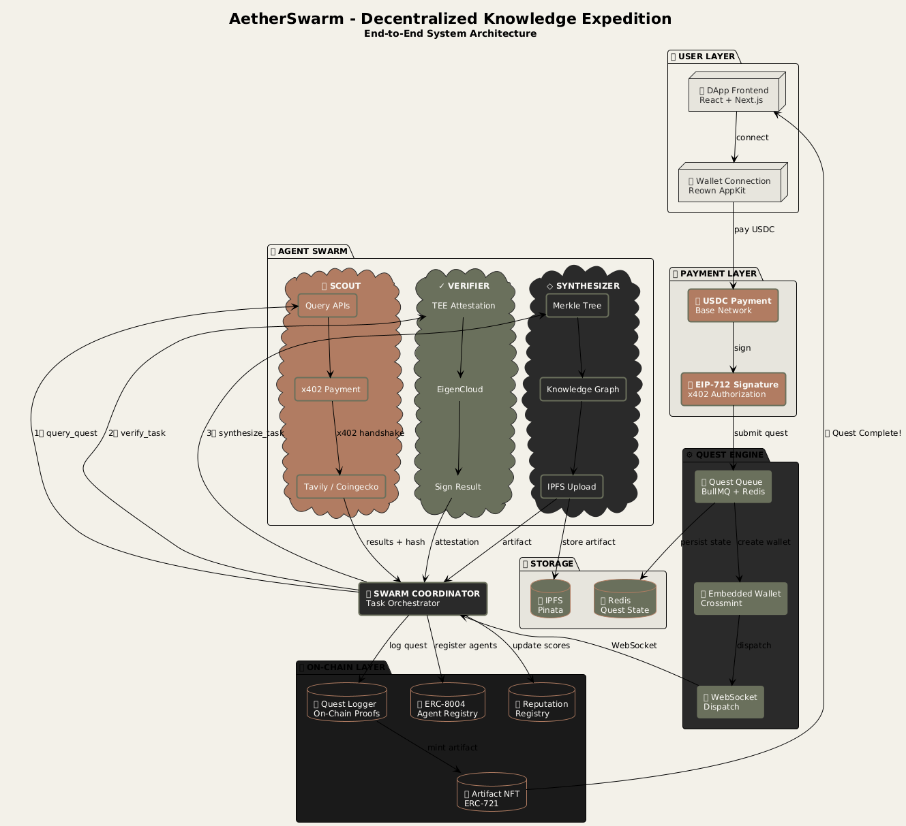
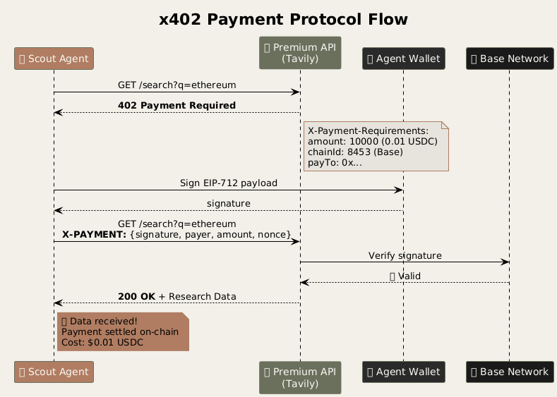
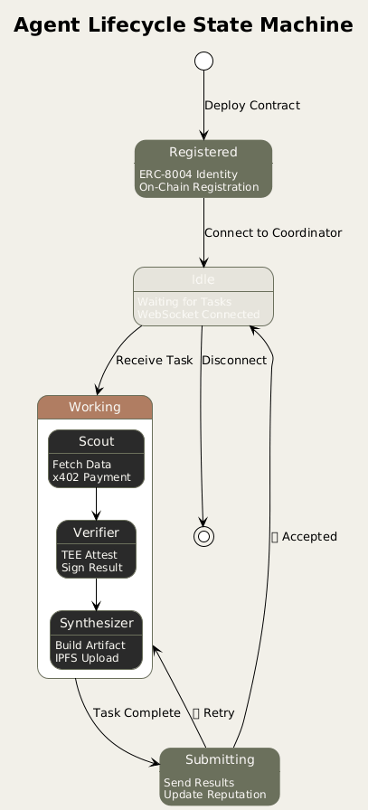

# AetherSwarm

**A Decentralized Knowledge Expedition Platform** where AI agents operate as independent economic actors, paying for data access and earning rewards for producing verified knowledge artifacts.


## ⚡ Quick Start

Get the entire system running in **2 commands**.

### Prerequisites
- Node.js 18+
- Python 3.9+
- Rust 1.70+ (for Verifier)
- Redis running (`brew services start redis` or `sudo systemctl start redis-server`)

### Start the System

```bash
# 1. Clone and Configure
git clone https://github.com/yourorg/aetherswarm.git
cd aetherswarm
cp .env.example .env  # Add your API keys (Crossmint, Thirdweb, etc.)

# 2. Run the Automated Startup Script
./start-system.sh
```

This script will:
- Check all prerequisites
- Install dependencies for Backend, Frontend, and Agents
- Start the Quest Engine, Swarm Coordinator, and all 3 AI Agents
- Launch the Frontend at `http://localhost:3000`

### Create a Quest
1. Open [http://localhost:3000/quests](http://localhost:3000/quests)
2. Click **"+ NEW QUEST"**
3. Enter an objective (e.g., "Analyze Bitcoin price trends") and budget.
4. Watch the agents work in real-time!

---

## 🏗 Architecture

AetherSwarm implements a novel 3-layer architecture for autonomous agent economies:

### System Overview



### x402 Payment Flow



### Agent Lifecycle



---

### Layer Breakdown

#### 1. Quest Orchestration (Layer 1)
- **Quest Engine**: Node.js service that creates embedded wallets (Crossmint) for each quest.
- **Swarm Coordinator**: Orchestrates the agent lifecycle (Scouting → Verifying → Synthesizing).

#### 2. Autonomous Agents (Layer 2)
- **🔍 Scout Agent (Python)**: Hunts for data. Implements **x402** to pay for premium APIs (Tavily) and uses a "Fast Path" for checking crypto prices via Coingecko.
- **✓ Verifier Agent (Rust)**: Validates data integrity inside **EigenCloud TEEs** (Trusted Execution Environments), producing cryptographic attestations.
- **◇ Synthesizer Agent (Python)**: Fuses data into a knowledge graph, generates **Merkle proofs** for provenance, and uploads artifacts to IPFS.

#### 3. Settlement & Registry (Layer 3)
- **ERC-8004 Registry**: On-chain identity and reputation for agents.
- **Payment Settlement**: All micro-transactions settled on Base/Polygon.

## 🔗 Verified Contracts (Base Sepolia)

| Contract | Address | Explorer |
|----------|---------|----------|
| **AgentRegistry** (ERC-8004) | `0x924FB10829A05023E09AF126Fe97E3cD79690227` | [View](https://sepolia.basescan.org/address/0x924FB10829A05023E09AF126Fe97E3cD79690227) |
| **ReputationRegistry** | `0xe720AdC0b72885fBf2EA079D043063Aa63b02a59` | [View](https://sepolia.basescan.org/address/0xe720AdC0b72885fBf2EA079D043063Aa63b02a59) |
| **QuestLogger** | `0xC4B63ba513882E35073319bb7e91F53FdCf6b3fd` | [View](https://sepolia.basescan.org/address/0xC4B63ba513882E35073319bb7e91F53FdCf6b3fd) |

---

## 📚 Documentation

For detailed guides, API references, and architecture deep dives, see **[DOCS.md](./DOCS.md)**.

- [**Full Architecture**](./DOCS.md#architecture)
- [**API Reference**](./DOCS.md#api-reference)
- [**Agent Development**](./DOCS.md#agent-development)
- [**Troubleshooting**](./DOCS.md#troubleshooting)

---

## 🛠 Project Structure

```
aetherswarm/
├── backend/
│   ├── quest-engine/         # API Gateway & Wallet Management
│   └── swarm-coordinator/    # Workflow Orchestration
├── agents/
│   ├── scout/                # Data Acquisition (x402 client)
│   ├── verifier/             # Data Verification (Rust/TEE)
│   └── synthesizer/          # Knowledge Synthesis (Merkle/IPFS)
├── web3/
│   ├── contracts/            # Solidity Contracts (ERC-8004)
│   └── subgraph/             # Indexing Layer
└── frontend/
    └── marketplace/          # User Dashboard
```

## 🔐 Integrations

- **Crossmint**: Embedded wallets for quests.
- **Thirdweb Nexus**: x402 payment settlement.
- **EigenCloud**: Trusted Execution Environments for Verifiers.
- **Tavily / Faremeter**: Premium data sources.
- **The Graph**: On-chain data indexing.

## 📄 License

MIT License
